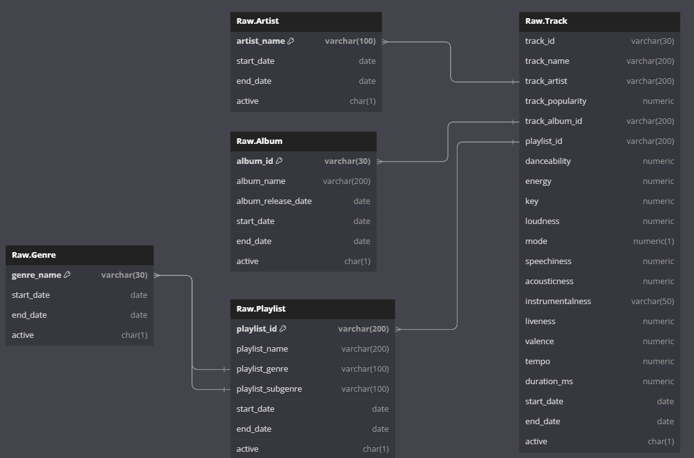

# Design Data Model for OLTP and OLAP databases for a given dataset

## Idea
 - Identify a popular dataset
 - Deign data model to store this data in an OLTP database
 - Load data into OLTP database
 - Design data model to move this data to an OLAP database
 - Move data into OLAP database
 - Identify 5 most frequently asked questions for this dataset
 - Write SQL Queries on OLAP database to answer above questions

### Identify a populat dataset
We used [Spotify 30000](https://www.kaggle.com/datasets/joebeachcapital/30000-spotify-songs) dataset for this exercise.

### Deign data model to store this data in an OLTP database
Spotify Dataset is a CSV file with below headers

```
track_id,track_name,track_artist,track_popularity,track_album_id,track_album_name,track_album_release_date,playlist_name,playlist_id,playlist_genre,playlist_subgenre,danceability,energy,key,loudness,mode,speechiness,acousticness,instrumentalness,liveness,valence,tempo,duration_ms

```

We can break down these headers into these entities for our Data model

```
Track
Album
Artist
Playlist
Genre
```

We can related each column in the dataset to one of these entities as below

```
Track
- track_id
- track_name
- track_popularity
- danceability
- energy
- key
- loudness
- mode
- speechiness
- acousticness
- instrumentalness
- liveness
- valence
- tempo
- duration_ms

Album
- album_id
- album_name
- album_release_date

Artist
- artist_name

Playlist
- playlist_id
- playlist_name
- playlist_genre
- playlist_subgenre

Genre
- genre_name

```

OLTP Database should be designed to reduce data redundancy. To achieve this, we have identified the attributes that can be their own entities and moved them to those tables. By doing this, we can insert one row in the table but use that row reference in multiple rows in another table.

