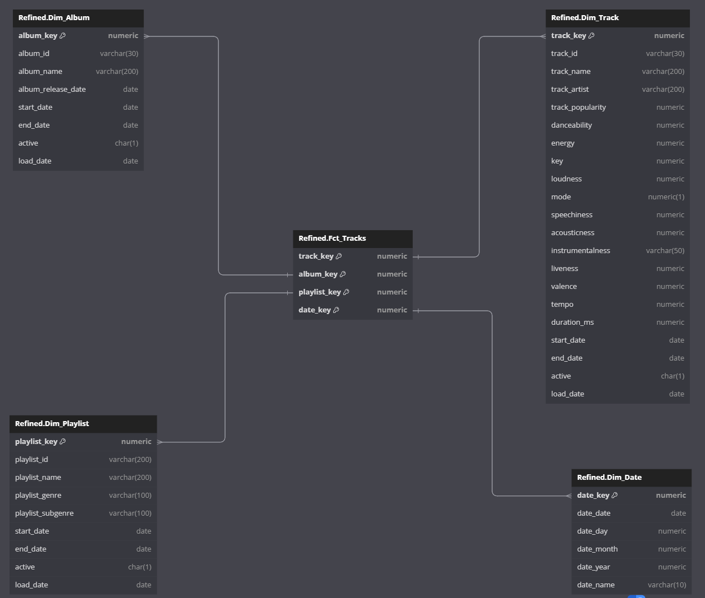

# Design Data Model for OLTP and OLAP databases for a given dataset

## Idea
 - Identify a popular dataset
 - Deign data model to store this data in an OLTP database
 - Load data into OLTP database
 - Design data model to move this data to an OLAP database
 - Move data into OLAP database
 - Identify 5 most frequently asked questions for this dataset
 - Write SQL Queries on OLAP database to answer above questions

### Identify a populat dataset
We used [Spotify 30000](https://www.kaggle.com/datasets/joebeachcapital/30000-spotify-songs) dataset for this exercise.

### Deign data model to store this data in an OLTP database
Spotify Dataset is a CSV file with below headers

```
track_id,track_name,track_artist,track_popularity,track_album_id,track_album_name,track_album_release_date,playlist_name,playlist_id,playlist_genre,playlist_subgenre,danceability,energy,key,loudness,mode,speechiness,acousticness,instrumentalness,liveness,valence,tempo,duration_ms

```

We can break down these headers into these entities for our Data model

```
Track
Album
Artist
Playlist
Genre
```

We can related each column in the dataset to one of these entities as below

```
Track
- track_id (PK)
- track_name
- track_popularity
- danceability
- energy
- key
- loudness
- mode
- speechiness
- acousticness
- instrumentalness
- liveness
- valence
- tempo
- duration_ms

Album
- album_id (PK)
- album_name
- album_release_date

Artist
- artist_name (PK)

Playlist
- playlist_id (PK)
- playlist_name
- playlist_genre
- playlist_subgenre

Genre
- genre_name (PK)

```

To enable Slowly Changing Dimension, we're adding below columns to every table

```
start_date
end_date
active

```

OLTP Database should be designed to reduce data redundancy. To achieve this, we have identified the attributes that can be their own entities and moved them to those tables. By doing this, we can insert one row in the table but use that row reference in multiple rows in another table.


### Load data into OLTP database

We're using Python to read the dataset using CSV Reader and load data into above created tables in OLTP database.

### Design data model to move this data to an OLAP database

OLAP Databases differ in Data model when compared to OLTP database. Since OLAP databases are focused more on Read performance, we want to design our tables with Facts and Dimensions tables, where Facts are the main attributes that we want to generate reports on, and dimensions are the tables where we load all the historical data that support these Facts.

To load data from above OLTP database, we have designed below data model in our OLAP database. Observe that we have merged Genre with Playlist and Artist with Track tables to avoid more joins between tables. Remember, we are focusing on Read performance more than storage performance. This model also has a Date dimension table whcih will be used to map all Date values in all tables, to remain consistent with date formats and values.

```
Dim_Album
- album_key (PK)
- album_id
- album_name
- album_release_date
- start_date
- end_date
- active
- load_date

Dim_Playlist
- playlist_key (PK)
- playlist_id
- playlist_name
- playlist_genre
- playlist_subgenre
- start_date
- end_date
- active
- load_date

Dim_Track
- track_key (PK)
- track_id 
- track_name 
- track_artist 
- track_popularity 
- danceability 
- energy 
- key 
- loudness 
- mode 
- speechiness 
- acousticness 
- instrumentalness 
- liveness 
- valence 
- tempo 
- duration_ms 
- start_date 
- end_date 
- active 
- load_date 

Dim_Date
- date_key (PK)
- date_date 
- date_day 
- date_month 
- date_year 
- date_name 
```

### Move data into OLAP database

We have used `etl_raw_to_refined.sql` ETL query to move all the date from Raw schema to Refined schema (i.e OLTP database to OLAP database). All the data will be loaded in above created Dimension tables.

### Identify 5 most frequently asked questions for this dataset

Let's assume these are the top 5 reports that we want to generate on our OLAP database data.

- What are 10 most popular songs in last 6 months ?
- Who are the 5 most popular artists in last 1 year ?
- How many albums got released in last 6 months ?
- Top 10 longest songs ever ?
- Top 7 Dance tunes of the year ?

Let's design our Fact table to answer these questions. So, we need data from Track, Album, Playlist and Date to answer these questions. Let's load data in Fact table with primary keys from all these dimensions

```
Fct_Tracks
- track_key 
- album_key 
- playlist_key 
- date_key
    [Primary key will be combination of all 4 columns]
```



### Write SQL Queries on OLAP database to answer above questions

To generate above reports, we have developed SQL queries as part of `stats.sql` file.
